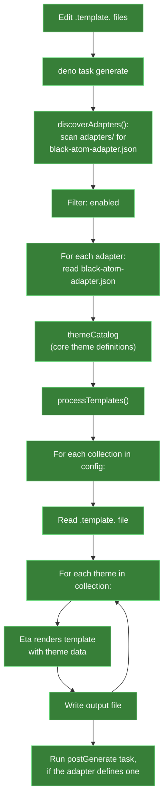

# Adapter Generation Architecture

How Black Atom Core generates theme files for adapters.

## Overview

Black Atom uses an adapter pattern: core defines all theme colors and properties, adapters
transform them into platform-specific files (Neovim Lua, Ghostty config, CSS, etc.) using
templates. Adapters live under `adapters/<name>/` in the same repository as core, and core is
always run from source, never fetched as a package.



## Tasks

At the repo root:

| Task                     | Purpose                                                           |
| ------------------------ | ----------------------------------------------------------------- |
| `deno task generate`     | Regenerate every adapter once                                     |
| `deno task dev:adapters` | Watch core and every adapter's templates, regenerate, and reapply |

Inside a single adapter directory (`adapters/<name>/`):

```json
{
    "tasks": {
        "generate": "deno run -A ../../core/src/cli/index.ts generate",
        "dev": "deno run -A ../../core/src/cli/index.ts generate --watch"
    }
}
```

| Task       | Purpose                                              |
| ---------- | ---------------------------------------------------- |
| `generate` | Regenerate this adapter only                         |
| `dev`      | Watch this adapter's templates, regenerate on change |

Both scopes share the same task names; which one runs depends on the working directory.

## Template Processing

Templates use [Eta](https://eta.js.org/) syntax. The output filename is derived from the template:

- `.template.` is removed from the filename
- `collection` in the path is replaced with the theme key

Example: `themes/collection.template.lua` → `themes/black-atom-jpn-koyo-yoru.lua`

Templates reference **UI**, **syntax**, and **palette** colors, never primaries directly. This
keeps adapters stable when core internals change.

## Custom Build Steps

Some adapters need more than a one-to-one template render. The obsidian adapter, for example,
assembles a single `theme.css` from generated per-theme CSS files, YAML settings, and static CSS.

An adapter can declare a `postGenerate` task in its `black-atom-adapter.json`; the generator runs
it via `deno task postGenerate` in the adapter directory after every file is written. This keeps
adapter-specific assembly logic inside the adapter, not in core.

## JSR Package

Core is published to JSR as [`@black-atom/core`](https://jsr.io/@black-atom/core).

### Exports

| Export                 | Entrypoint         | Purpose                        |
| ---------------------- | ------------------ | ------------------------------ |
| `@black-atom/core`     | `src/mod.ts`       | Theme types and `themeBundle`  |
| `@black-atom/core/cli` | `src/cli/index.ts` | CLI for the `generate` command |

### What's Included

- All theme definitions and shared components (`src/themes/`)
- CLI and supporting libraries (`src/cli/`, `src/lib/`)
- Type definitions (`src/types/`)
- Color utilities (`src/utils/`)
- Adapter config schema (`adapter.schema.json`)

### What's Excluded

- Task system (`src/tasks/`), only needed when running from source in this monorepo
- Schema generation script (`src/lib/generate-schema.ts`)
- Adapter discovery (`src/lib/discover-adapters.ts`)

## Key Design Decisions

| Decision                                         | Rationale                                                |
| ------------------------------------------------ | -------------------------------------------------------- |
| Templates use UI/syntax/palette, never primaries | Stable adapter API even when core color internals change |
